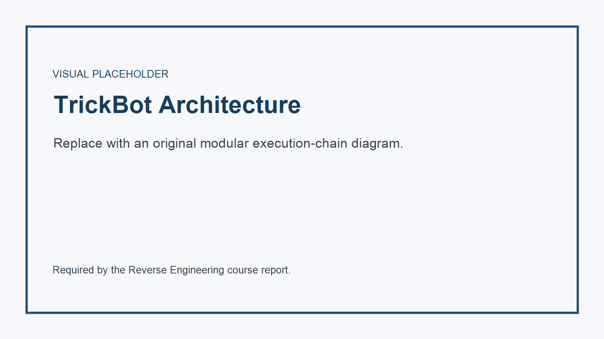
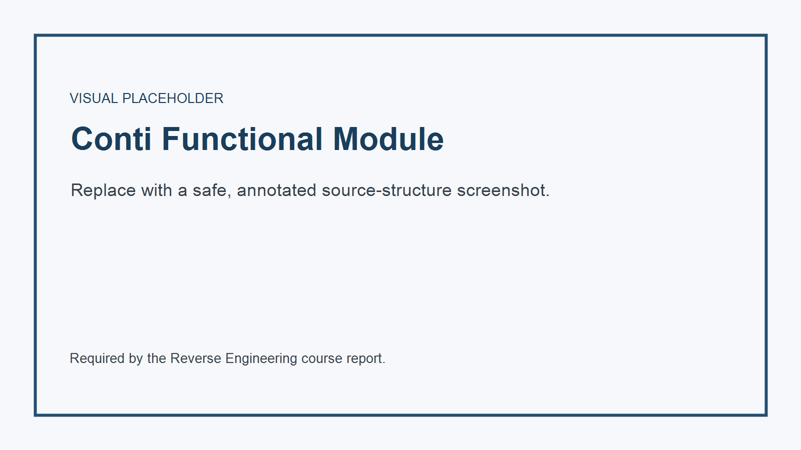

**[TRACKING: instructions.md Step 1; syllabus p.1 metadata requirement]**

| Full Name (Hebrew) | Full Name (English) | ID Number (ת"ז) | Email Address | Phone Number | Lecture Group (Day/Hour) |
| :--- | :--- | :--- | :--- | :--- | :--- |
| [Insert Name] | [Insert Name] | [Insert ID] | [Insert Email] | [Insert Phone] | [Insert Group] |

**[TRACKING: instructions.md report title; syllabus Tasks 1 and 2]**

# Reverse Engineering Research Project

**TrickBot Modular Malware, Independent Technical Briefings, and Conti Leaked Source-Code Evaluation**

> **Research date:** 6 June 2026  
> **Scope rule:** Sections explicitly marked optional in the syllabus are omitted.  
> **Safety rule:** This report describes architecture and defensive implications. It does not reproduce deployable malware, exploit code, or operational instructions.

---

**[TRACKING: instructions.md Step 2; syllabus Task 1, mandatory technical profile]**

## Task 1 - TrickBot Modular Malware Dossier

**[TRACKING: instructions.md Step 2, Architecture Overview; syllabus Task 1 technical-detail requirement]**

### 1. Architecture Overview

TrickBot is a **modular, multi-stage Windows malware platform**, not merely a
single banking Trojan. Microsoft describes a typical chain containing a
changing wrapper, an in-memory loader, and the main malware module. The loader
decrypts functions only when needed, resolves APIs dynamically, and starts the
main module in memory. On 64-bit systems, some variants use Heaven's Gate and a
64-bit loader before injection into a suspended process [S1].

The main component establishes persistence, identifies the host, decrypts its
configuration, and retrieves only the modules needed for that campaign. This
design separates stable orchestration from specialized capabilities and lets
operators replace individual components without rebuilding the entire platform.
Kaspersky catalogued dozens of 32-bit and 64-bit modules, while Check Point
reported more than 20 modules active across TrickBot's lifetime [S2][S3].

**Representative functional modules**

| Module or family | Defensive interpretation |
| :--- | :--- |
| `systeminfo` / `networkDll` | Collects operating-system, process, domain, network, and Active Directory context. |
| `pwgrab` / `tdpwgrab` | Targets credentials and application data, including browsers, mail, remote-access tools, keys, and wallets. |
| `injectDll` / `webiDll` | Performs browser interception and web-inject activity against financial sessions. |
| `adll` | Uses native administration tools to collect Active Directory database and registry-hive material. |
| `bcClient` / `NewBCtestn` | Supplies reverse-proxy capability and can support movement through a compromised host. |
| `mshare`, `tab`, `mworm` / `nworm`, `wormDll` | Implements network propagation through shares, remote execution, stolen credentials, or an SMB exploit path. |

**Architectural consequence:** defenders should correlate the loader,
module-fetch behavior, memory execution, process injection, scheduled-task
persistence, and the behavior of each downloaded module. A signature for one
module cannot represent the full TrickBot platform.

**[TRACKING: instructions.md Step 2, Infection Chain; syllabus Task 1 internal-mechanism requirement]**

### 2. Infection and Execution Chain

1. **Delivery:** historically, malicious Office documents, links, or another
   loader such as Emotet delivered the first stage [S4].
2. **Wrapper execution:** a frequently changing wrapper obscures the stable
   loader and reduces simple hash-based detection [S1].
3. **In-memory loading:** the loader decrypts code and strings at runtime,
   resolves Windows APIs dynamically, and launches the core component [S1].
4. **Privilege and persistence:** variants may attempt UAC bypass and create
   scheduled tasks. Main components and plug-ins are commonly injected into
   legitimate processes such as `svchost.exe` [S1][S5].
5. **Configuration bootstrap:** the bot decrypts embedded or local
   configuration data, derives a bot identity and campaign tag, and contacts
   controller infrastructure for updated configuration and modules [S1][S6].
6. **Capability expansion:** modules perform credential theft, discovery,
   browser interception, proxying, Active Directory collection, propagation,
   or delivery of later payloads [S2].
7. **Network expansion:** propagation modules enumerate reachable systems and
   domain resources, then use SMB shares, remote execution, credentials, or an
   exploit-dependent path [S2][S7].

This chain also explains why a forensic image may show different artifacts on
different hosts: the controller can assign modules by architecture, campaign,
privilege level, and network position.

**[TRACKING: instructions.md Step 2, Cryptographic Layer; syllabus Task 1 internal technical mechanism]**

### 3. Cryptographic and Obfuscation Layer

TrickBot's cryptography changed between generations, so no single algorithm
describes every sample.

- **Configuration and module protection:** early documented variants used AES
  in CBC mode. A custom iterative SHA-256 construction derives key and IV
  material from the encrypted blob. If AES parsing failed, the implementation
  could attempt an ECC-based path [S6].
- **Additional wrapping:** later configurations added a first-stage DWORD-wise
  XOR layer before the established configuration decoder. F5 observed the key
  and data length stored at the front of the configuration object [S8].
- **Runtime concealment:** the loader decrypts individual functions and strings
  only for use, then can re-encrypt them. APIs are resolved dynamically instead
  of appearing as a complete static import table [S1][S8].
- **Windows CryptoAPI in resource handling:** a documented variant acquired a
  provider with `CryptAcquireContextW`, imported key material with
  `CryptImportKey`, operated on an encrypted resource, and released handles
  with `CryptDestroyKey` [S9]. These calls describe that analyzed variant, not a
  guaranteed invariant of all TrickBot builds.
- **Certificate-chain subversion in browser interception:** newer `injectDll`
  variants hooked `CertGetCertificateChain` and
  `CertVerifyCertificateChainPolicy` so a locally generated certificate could
  support interception without normal browser validation failures [S2].

The protected objects include the hardcoded bootstrap configuration, updated
controller lists, module binaries, module-specific configuration, and
web-inject rules. Cryptography here serves **confidentiality from analysts,
integrity/control of tasking, and signature instability**, rather than a single
user-facing encryption function.

**[TRACKING: instructions.md Step 2, Vulnerability Registry; syllabus Task 1 item 9]**

### 4. Vulnerability and Propagation Registry

The MS17-010 bulletin covers a family of SMBv1 defects represented by
**CVE-2017-0143 through CVE-2017-0148**. These include remote-code-execution and
information-disclosure conditions in Microsoft SMBv1 [S10].

| CVE | Assignment-relevant interpretation |
| :--- | :--- |
| CVE-2017-0143 | SMBv1 remote-code-execution vulnerability in the MS17-010 cluster. |
| CVE-2017-0144 | SMBv1 remote-code-execution vulnerability most commonly associated with EternalBlue reporting. |
| CVE-2017-0145 | SMBv1 remote-code-execution vulnerability in the same bulletin. |
| CVE-2017-0146 | SMBv1 remote-code-execution vulnerability in the same bulletin. |
| CVE-2017-0147 | SMBv1 remote-code-execution vulnerability in the same bulletin. |
| CVE-2017-0148 | SMBv1 information-disclosure vulnerability in the same bulletin. |

**Attribution caveat:** listing the complete MS17-010 cluster does not prove
that every TrickBot build exploited every CVE. Kaspersky identifies
`wormDll` as an EternalBlue propagation component that places shellcode in
`lsass.exe` memory and retrieves TrickBot [S2]. Palo Alto also warned that
other TrickBot SMB propagation behavior differed from WannaCry's EternalBlue
implementation [S4]. Therefore, the defensible conclusion is:

- TrickBot had an EternalBlue-capable propagation path.
- TrickBot also used share- and credential-based propagation.
- Sample-specific reverse engineering is required before assigning a precise
  exploit implementation to one CVE.

**[TRACKING: instructions.md TrickBot visual placeholder]**

---

**[TRACKING: instructions.md Step 3 Q11; syllabus p.4 Q11]**

## Q11 - Recent Vulnerability: CVE-2024-3400

**CVE-2024-3400** is a critical PAN-OS GlobalProtect vulnerability disclosed on
12 April 2024. Palo Alto Networks describes the root condition as arbitrary
file creation leading to operating-system command injection. On affected,
specifically configured PAN-OS 10.2, 11.0, and 11.1 firewalls, an unauthenticated
network attacker could execute code with root privileges [S11][S12].

**Mechanism summary**

- Untrusted GlobalProtect request data reached a file-creation path without a
  safe trust boundary.
- Attacker-controlled data later entered a privileged command-execution
  context.
- The impact crossed from a network-facing service to root-level appliance
  execution.
- Cloud NGFW, Panorama appliances, Prisma Access, and older PAN-OS branches
  listed by the vendor were not affected [S11].

Operationally, exploitation could provide full control of the firewall,
credential or configuration access, persistence opportunities, and a pivot
point into protected networks. The CVE was observed in production exploitation,
which is why product configuration and exact hotfix levels matter more than the
headline CVSS score alone.

**[TRACKING: instructions.md Q11 visual placeholder]**

---

**[TRACKING: instructions.md Step 3 Q12; syllabus p.4 Q12]**

## Q12 - Two MITRE D3FEND Defensive Techniques

The following entries come from different D3FEND parent pillars.

**[TRACKING: instructions.md Q12 Detect branch; MITRE D3FEND D3-PSA]**

### Detect: Process Spawn Analysis (D3-PSA)

Process Spawn Analysis evaluates process-creation attributes such as user,
image path, process name, parent relationship, arguments, and security context
to identify unauthorized execution [S13].

**Configuration principles**

- Collect process-creation telemetry with full image path, command line, user,
  integrity level, signer, hash, and parent process.
- Normalize command-line parsing before applying detections.
- Alert on impossible or rare parent-child relationships, execution from
  user-writable paths, and trusted names launched from untrusted locations.
- Do not trust parent PID alone; attackers can spoof it.

**[TRACKING: instructions.md Q12 Harden branch; MITRE D3FEND D3-ACH]**

### Harden: Application Configuration Hardening (D3-ACH)

Application Configuration Hardening reduces attack surface by disabling
unneeded features and limiting permissions according to the application's
actual environment [S14].

**Configuration principles**

- Disable unused remote interfaces, scripting, plug-ins, and legacy protocols.
- Run services with dedicated least-privilege identities.
- Restrict write access to configuration, extension, and executable paths.
- Maintain a version-controlled security baseline and alert on drift.

The first technique detects suspicious execution after process creation; the
second reduces which application behaviors are available before exploitation.

---

**[TRACKING: instructions.md Step 3 Q13; syllabus p.4 Q13]**

## Q13 - Chinese Threat Group: APT41

MITRE tracks **APT41 (G0096)** as a Chinese state-sponsored espionage group that
also conducts financially motivated operations. Aliases include **Wicked Panda,
Brass Typhoon, BARIUM**, and partial overlap with **Winnti Group** reporting
[S15].

**Target profile**

- Healthcare, telecommunications, technology, finance, education, retail, and
  video-game organizations.
- Campaigns across at least 14 countries.
- Public-facing applications, software supply chains, and credentialed access
  are recurring entry points.

**Verified custom or closely associated tooling**

- `BLACKCOFFEE`, `HIGHNOON`, `LOWKEY`, `DEADEYE`
- `DUSTPAN`, `DUSTTRAP`, `KEYPLUG`
- Winnti-family backdoors and web shells such as China Chopper
- Commodity support tools including Cobalt Strike, Mimikatz, and Impacket

The distinction matters: commodity tools do not uniquely identify APT41.
Attribution depends on infrastructure, victimology, timing, certificates,
malware lineage, and TTP combinations.

---

**[TRACKING: instructions.md Step 3 Q14; syllabus p.4 Q14]**

## Q14 - macOS Malware: RustBucket

**RustBucket** is a multi-stage macOS family associated by Jamf with the
BlueNoroff/Lazarus ecosystem. Its first stage was a compiled AppleScript
application masquerading as an internal PDF viewer. The Objective-C second
stage opened a specially prepared PDF and retrieved a later payload [S16].

**Processor architecture**

- Intel Macs execute `x86_64` Mach-O code natively.
- Apple Silicon Macs execute `arm64` natively and may run supported Intel code
  through Rosetta 2.
- Jamf analyzed both ARM and Intel RustBucket executables, demonstrating that
  operators accounted for both hardware populations [S16].

A multi-architecture deployment can ship separate architecture-specific
binaries or a universal Mach-O containing both slices. Native ARM64 support
avoids relying on Rosetta availability and changes reverse-engineering details:
register conventions, instruction set, calling convention, and disassembler
output differ from x86-64. The high-level Objective-C application behavior,
bundle structure, and Cocoa APIs can remain similar across both builds.

---

**[TRACKING: instructions.md Step 3 Q15; syllabus p.4 Q15]**

## Q15 - Bring Your Own Vulnerable Driver (BYOVD)

BYOVD is a defense-evasion and privilege technique in which an attacker with
sufficient installation rights loads a **legitimately signed but vulnerable
kernel driver**. The signature satisfies the normal driver trust path, while
unsafe device-control handlers expose privileged operations to user mode.

**Real case:** `mhyprot2.sys` version 1.0.0.0, the Genshin Impact anti-cheat
driver, is tracked as **CVE-2020-36603**. NVD states that it inadequately
restricts unprivileged function calls and can permit SYSTEM-level code
execution after administrative installation [S17]. Trend Micro documented
ransomware operators using the signed driver to terminate security processes
[S18].

**Pipeline**

1. The attacker obtains administrative execution through an earlier compromise.
2. The signed vulnerable driver is dropped and registered as a kernel service.
3. A user-mode controller opens the device object and sends exposed IOCTLs.
4. The driver performs privileged memory or process operations on the
   controller's behalf.
5. Security products are terminated or altered from kernel context, after which
   the primary payload proceeds.

Mitigation requires more than patching the original game: vulnerable-driver
blocklists, WDAC/HVCI, driver inventory, and alerts on new kernel services are
needed because an old signed driver can be carried independently.

---

**[TRACKING: instructions.md Step 3 Supply Chain; syllabus p.5 Q24; instructions label Q20]**

## Q24 (Instructions: Q20) - XZ Utils Supply-Chain Backdoor

The **XZ Utils 5.6.0 and 5.6.1** incident, tracked as **CVE-2024-3094**, is a
landmark attempted supply-chain compromise.

**Execution/distribution timeline**

- **24 February 2024:** xz 5.6.0 was released.
- **9 March 2024:** xz 5.6.1 was released.
- The malicious build logic was present in release tarballs, while key trigger
  material was absent from the ordinary Git source view.
- **29 March 2024:** Andres Freund publicly reported the issue after tracing
  abnormal `sshd` CPU use and authentication latency; Red Hat issued its urgent
  alert the same day [S19][S20].

The injected build process produced a modified `liblzma` that, under specific
Linux build and service conditions, could interfere with `sshd` authentication
through systemd-linked dependencies. The compromise targeted the **build and
distribution trust chain**, not a normal xz feature [S19].

**Blast radius**

Affected packages reached development or unstable distributions including
Fedora Rawhide/Fedora 40 beta and Debian unstable contexts. Discovery occurred
before broad inclusion in stable enterprise distributions, sharply limiting
real-world deployment. The potential impact was nevertheless severe because xz
is a transitive dependency in widely deployed Linux software.

---

**[TRACKING: instructions.md Step 3 RAT briefing; syllabus p.5 Q21]**

## Q21 - Popular RAT Framework: Remcos

MITRE tracks **Remcos (S0332)** as a closed-source Windows remote-control and
surveillance tool that has repeatedly appeared in malicious campaigns [S21].

**Capabilities**

- Keylogging and clipboard collection.
- Automated screenshots and application-window discovery.
- Microphone capture and remote environmental observation.
- File search, upload, download, deletion, and archive creation.
- Registry control, persistence through Run keys, and UAC-bypass commands.
- Stored-browser-data collection and remote command execution.

The controller sends tasking to the installed agent; the agent invokes Windows
APIs, packages results, and returns them over its remote channel. Keylogging
captures input events over time, while screenshots and window enumeration give
the operator visual and contextual awareness. These features make Remcos both a
legitimate dual-use administration product and a high-risk post-compromise
tool when deployed without authorization.

---

**[TRACKING: instructions.md Step 3 fileless briefing; syllabus p.5 Q22]**

## Q22 - Fileless Malware Execution

“Fileless” describes an execution technique, not an absence of all artifacts.
Attackers use trusted interpreters and memory-resident loading so the principal
payload does not need to exist as a conventional executable on disk.

**Typical flow**

1. A macro, command line, WMI event, registry value, or network response holds
   an encoded script or payload.
2. PowerShell, WMI, JavaScript/VBScript, or a .NET runtime decodes the content.
3. The runtime allocates memory and executes script, shellcode, or a reflectively
   loaded module.
4. Persistence may remain in WMI or the registry rather than a normal executable
   path.

Microsoft notes that PowerShell and WMI can load scripts directly in memory and
that reflective DLL loading can execute a library without normal disk-backed
module loading [S22][S23]. Evidence still exists in process, script-block,
AMSI, WMI, registry, memory, and network telemetry.

---

**[TRACKING: instructions.md Step 3 AI vulnerability; syllabus p.5 Q20]**

## Q20 - LLM Infrastructure Vulnerability: Prompt Injection

OWASP classifies **Prompt Injection as LLM01:2025**. A direct injection comes
from the user; an indirect injection is embedded in external content such as a
web page, document, email, or image that the model later processes [S24].

The core weakness is a trust-boundary failure: instructions and data are
represented in the same natural-language context, while the model may also
hold tools or credentials. A successful injection can manipulate output,
disclose sensitive context, invoke unauthorized functions, or influence a
high-impact decision.

**Mitigation**

- Treat retrieved content and model output as untrusted.
- Give the model least-privilege, task-specific credentials.
- Validate tool arguments and outputs with deterministic code.
- Require human approval for privileged or irreversible actions.
- Separate external content from control instructions.
- Continuously test direct, indirect, multilingual, encoded, and multimodal
  injection cases.

RAG and fine-tuning can improve relevance but do not remove this architectural
risk [S24].

---

**[TRACKING: instructions.md Step 3 AI-enabled threat activity; syllabus p.5 Q25]**

## Q25 - Documented Threat-Actor Use of AI

Public reporting supports three distinct patterns.

- **Code assistance:** OpenAI and Microsoft reported that Charcoal Typhoon used
  models to debug code and generate scripts, while other state-affiliated
  actors requested scripting help, vulnerability research, and methods for
  hiding processes or evading detection [S25].
- **Social engineering:** Crimson Sandstorm and Emerald Sleet used models to
  draft or improve content suitable for spear-phishing. Later Microsoft
  reporting describes AI as an accelerator for polished lures, translation,
  identity maintenance, and malware debugging rather than a fully autonomous
  attacker [S25][S26].
- **Machine-learning components inside stealers:** trojanized Telegram and
  WhatsApp applications used Google's ML Kit OCR to find cryptocurrency seed
  phrases in stored screenshots. SparkCat later used an OCR plug-in in malicious
  Android and iOS applications for the same objective [S27][S28].

The evidence does not justify claiming that LLMs independently conducted these
campaigns. Human operators retained control of targeting and deployment; AI
reduced language, coding, and data-processing friction.

---

**[TRACKING: instructions.md Step 3 Q26; syllabus p.5 Q26]**

## Q26 - Iranian Threat Group: MuddyWater

MITRE identifies **MuddyWater (G0069)** as an Iranian cyber-espionage group
assessed to be subordinate to the Ministry of Intelligence and Security. Aliases
include **Earth Vetala, MERCURY, Static Kitten, Seedworm, TEMP.Zagros, Mango
Sandstorm, TA450**, and **MuddyKrill** [S29].

**Target profile**

- Government, telecommunications, finance, defense, and oil and gas.
- Strong focus on the Middle East, with activity also in Asia, Africa, Europe,
  and North America.

**Tool registry**

- `POWERSTATS` PowerShell backdoor
- `PowGoop` loader
- `Small Sieve` Python backdoor
- `Mori` and `MuddyC2Go` backdoors
- `Out1` Python tooling
- Commodity utilities such as LaZagne, Mimikatz, and remote-administration tools

Common tradecraft includes spear-phishing, PowerShell/VBScript/JavaScript
execution, cloud file-sharing services for payload delivery, browser credential
theft, and HTTP-based command and control. As with APT41, a commodity tool alone
is insufficient attribution evidence.

---

**[TRACKING: instructions.md Step 3 Q29; syllabus p.6 Q29]**

## Q29 - iOS Vulnerability Cluster: Operation Triangulation

Operation Triangulation used a zero-click iMessage chain against iOS versions
up to 16.2. The attachment was processed without visible user interaction.
Kaspersky's reconstructed chain includes:

- **CVE-2023-41990:** remote code execution through an undocumented TrueType
  font instruction.
- JavaScriptCore manipulation and a privilege-escalation stage.
- **CVE-2023-32434:** XNU integer overflow used to gain broad physical-memory
  read/write capability.
- **CVE-2023-38606:** bypass of hardware-backed Page Protection Layer controls
  through undocumented MMIO behavior on A12-A16 SoCs [S30].

After kernel-level compromise, the chain removed exploitation artifacts,
launched an invisible Safari stage, and installed the TriangleDB espionage
platform.

**Persistence correction:** the toolset was **not persistent across reboot**.
Kaspersky reported that devices could be **reinfected after reboot**, which can
look like persistence from outside but is technically a fresh zero-click
compromise [S31]. This distinction is important in both incident response and
reverse engineering.

---

**[TRACKING: instructions.md Step 4; syllabus Task 2 mandatory leaked-source evaluation]**

## Task 2 - Conti Ransomware Leaked Source-Code Evaluation

**[TRACKING: instructions.md Step 4 repository hyperlink; syllabus Task 2 source-code URL requirement]**

### 1. Repository and Provenance

Public research states that Conti source material was leaked on 27 February
2022, alongside internal communications, after the group publicly supported
Russia's invasion of Ukraine [S32].

**Research links**

- Public mirror used for structural review:
  <https://github.com/gharty03/Conti-Ransomware>
- Course-recommended malware-source index:
  <https://github.com/ytisf/theZoo/tree/master/malware/Source/Original>
- Peer-reviewed analysis:
  <https://doi.org/10.1109/ACCESS.2022.3207757>

The GitHub mirror warns that it contains fixes to intentionally damaged or
missing build material. It is therefore a **secondary mirror**, not an
authenticated original development repository [S33]. The `theZoo` link is an
index recommended by the course material, but its current `Source/Original`
listing is not evidence that it hosts this exact Conti tree [S34]. This report
does not download, compile, or execute either repository.

**[TRACKING: instructions.md Step 4 codebase structure; syllabus Task 2 technical analysis]**

### 2. Codebase Structure

The public mirror reports **C++ (62.8%) and C (37.2%)** and exposes the
following root structure: `.vs/`, `Debug/`, `Release/`, `builder/`,
`decryptor/`, `locker/`, `ContiLocker_v2.sln`, `R3ADM3.txt`, and repository
metadata [S33]. The first three directories are development/build artifacts;
the meaningful product divisions are `builder`, `decryptor`, and `locker`.

The high-level structure separates:

| Area | Function |
| :--- | :--- |
| Builder/configuration | Produces campaign-specific locker configuration and embedded values. |
| Locker/encryptor | Enumerates local and network files, applies encryption policy, writes ransom notes, and coordinates worker threads. |
| Decryptor | Reverses file transformation when supplied with matching key material. |
| API and string abstraction | Resolves libraries/functions dynamically and hides sensitive strings behind hashes or obfuscation macros. |
| Cryptographic modules | Implements asymmetric key wrapping and high-throughput file encryption primitives. |
| Filesystem/share enumeration | Walks directories, applies exclusion rules, and discovers network shares. |
| Network scanner | Enumerates candidate hosts and services used to find reachable shares. |
| Thread pool and queues | Schedules file and network work concurrently for throughput. |
| Logging/memory/string helpers | Supplies custom runtime support shared by the operational components. |

The IEEE analysis identifies dynamic library loading, API hashing,
anti-hooking/unhooking, command-line modes, share enumeration, network scanning,
shadow-copy deletion, and multithreaded encryption as explicit source-level
flows [S32]. Representative functional units discussed in analyses include API
resolution, filesystem traversal, network scanning, encryption, RSA/key
handling, thread-pool queues, logging, memory allocation, and custom strings.

**[TRACKING: instructions.md Step 4 functional-module analysis; syllabus Task 2]**

### 3. Functional Interpretation

- **Startup and argument parsing** choose local, network, or combined encryption
  scope and optional host-list input.
- **API resolution** keeps much of the true dependency set out of the static
  import table.
- **Anti-hook logic** attempts to restore clean system-library code before
  sensitive operations, reducing visibility from user-mode hooks.
- **Discovery** enumerates local volumes, directories, network addresses, and
  shares while applying exclusions.
- **Concurrency** places file work into queues consumed by multiple threads,
  increasing encryption throughput.
- **Cryptography** uses fast symmetric file encryption combined with
  attacker-controlled asymmetric key protection so recovery material is not
  locally available.

This is an architectural description only. Build steps, weaponization changes,
keys, and deployable code are intentionally excluded.

**[TRACKING: instructions.md Step 4 reverse-engineering advantage; syllabus Task 2]**

### 4. Why Source Accelerates Reverse Engineering

Source code collapses uncertainties that take substantial time to resolve in
assembly:

- Function and type boundaries are explicit.
- Data structures, queue ownership, and thread synchronization are visible.
- Conditional compilation reveals variant behavior.
- Error paths and exclusions are distinguishable from anti-analysis tricks.
- Cryptographic intent can be separated from compiler-generated operations.
- Source names provide hypotheses that can be validated against binaries and
  telemetry.

Source review does **not** replace binary analysis. A leak may be incomplete,
modified, older than the observed sample, or built with different flags.
Reverse engineers should use it as a comparative map, then verify each claim
against the executable, runtime behavior, and independent reporting.

**[TRACKING: instructions.md Step 4 repository visual placeholder]**

**[TRACKING: instructions.md Step 4 code visual placeholder]**

---

**[TRACKING: instructions.md Step 5; syllabus source-list and article-copy requirements]**

## Reversed Bibliography

The complete numbered bibliography and source preservation checklist are in
[`sources/source_manifest.md`](./sources/source_manifest.md). Every inline
reference `[S#]` maps to that register.

No full third-party articles are reproduced in this project. Before course
submission, the student should create a separate, lawful PDF print or full-page
screenshot of each cited article as required by the syllabus.

---

**[TRACKING: instructions.md Step 6; syllabus p.2 AI policy]**

## AI Utility and Compliance Record

The AI-use record is in [`ai/ai_usage_log.md`](./ai/ai_usage_log.md). It records
the supplied prompts, research workflow, corrections, and manual verification
tasks without claiming that AI output is an authoritative source.

**[TRACKING: instructions.md Step 6 visual placeholder]**

---

**[TRACKING: instructions.md omission rule; syllabus optional-section policy]**

## Scope Compliance Statement

The report intentionally omits the syllabus sections explicitly marked
optional, including historical background, full C2 infrastructure analysis,
threat-group economics, Cyber Kill Chain mapping, anti-debug catalogues,
additional injection-method surveys, and other optional expansions. Mandatory
short independent questions selected by `instructions.md` are retained.
